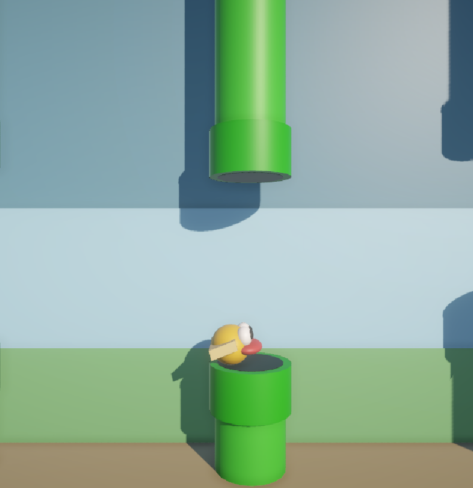

# 🐤 Flappy Clone - Unity WebGL

Um jogo estilo **Flappy Bird**, desenvolvido em **Unity** e publicado em **WebGL**. Controle o personagem usando a tecla **Espaço** para voar e desviar dos obstáculos. Quando perder, pressione **Espaço** novamente para reiniciar a partida.

 <!-- Substitua por uma imagem do jogo, se quiser -->

## 🎮 Como Jogar

- Pressione **Espaço** para fazer o pássaro voar.
- Desvie dos obstáculos (canos).
- Se bater em algo, o jogo termina.
- Pressione **Espaço** novamente para reiniciar o jogo.

## 🚀 Jogar Online

Você pode jogar diretamente no navegador:  
👉 [**Jogue agora (WebGL)**](https://seu-link-aqui.com)

## 🛠️ Tecnologias Utilizadas

- **Unity** 2021+
- **C#**
- **WebGL Build**
- Mecânicas simples com `Rigidbody2D`, `Colliders` e `Scenes`

## 📦 Instalação Local

Caso queira rodar o projeto localmente:

1. Clone o repositório:
   ```bash
   git clone https://github.com/seuusuario/flappy-clone.git
